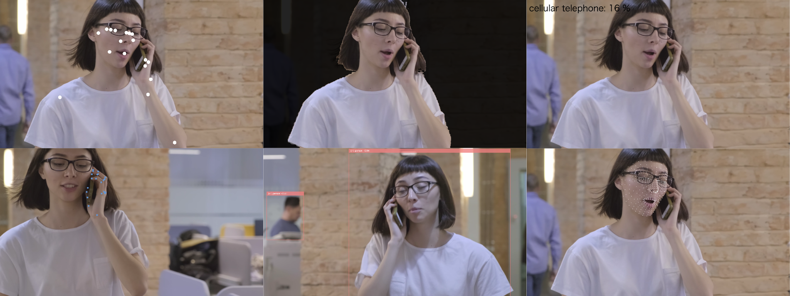

# p5MediaPipe
Easy to go mediapipe samples with p5.js!!

## Examples
* hands-landmarker : <a href="https://tetsuakibaba.github.io/p5MediaPipe/hands-landmarker/" target="_blank">DEMO</a>
* object-detection : <a href="https://tetsuakibaba.github.io/p5MediaPipe/object-detection/" 
target="_blank">DEMO</a>
* object-detection-mobile-web-app-template : <a href="https://tetsuakibaba.github.io/p5MediaPipe/object-detection-mobile-web-app-template/" 
target="_blank">DEMO</a>
* gesture-recognition : <a href="https://tetsuakibaba.github.io/p5MediaPipe/hands-landmarker-gesture-recognition/" target="_blank">DEMO</a>
* image classification: <a href="https://tetsuakibaba.github.io/p5MediaPipe/image-classification/" 
target="_blank">DEMO</a>
* image segmentation: <a href="https://tetsuakibaba.github.io/p5MediaPipe/image-segmentation/" 
target="_blank">DEMO</a>
* face landmark detection: <a href="https://tetsuakibaba.github.io/p5MediaPipe/face-landmarker/" target="_blank">DEMO</a>
* pose landmark detection: <a href="https://tetsuakibaba.github.io/p5MediaPipe/pose-landmarker/" target="_blank">DEMO</a>

## Reference
* mediapipe by Google: https://developers.google.com/mediapipe
* p5.js by processing foundation: https://p5js.org/
* fauxelsによる動画: https://www.pexels.com/ja-jp/video/3253739/
